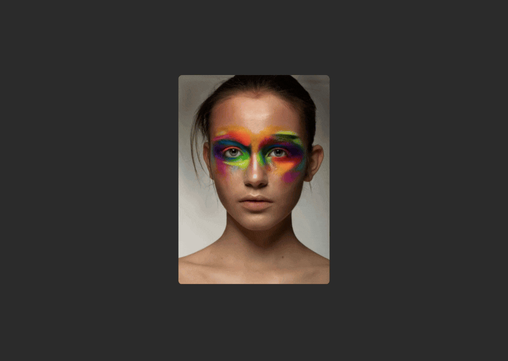

# 3D Card Flip Animation

A beautiful and interactive 3D card flip animation built with HTML, CSS, and JavaScript. This project demonstrates modern CSS 3D transforms and hover effects to create an engaging user experience.



## ✨ Features

- **3D Flip Animation**: Smooth card rotation on hover using CSS transforms
- **Responsive Design**: Works on various screen sizes
- **Modern UI**: Clean and professional design with gradient backgrounds
- **Social Media Integration**: Ready-to-use social media icons
- **Customizable**: Easy to modify content, colors, and styling

## 🚀 Demo

Hover over the card to see the 3D flip animation in action!

## 📁 Project Structure

```
3d-card/
├── index.html          # Main HTML structure
├── style.css           # CSS styles and animations
├── image-400.png       # Card front image
├── 3d-card.gif         # Animation demonstration
└── README.md           # Project documentation
```

## 🛠️ Technologies Used

- **HTML5**: Semantic markup structure
- **CSS3**: 
  - 3D Transforms (`transform-style: preserve-3d`)
  - Backface Visibility (`backface-visibility: hidden`)
  - Smooth Transitions (`transition: transform 1s`)
  - Hover Effects
- **Font Awesome**: Social media icons
- **Google Fonts**: Poppins font family

## 🎯 How It Works

1. **Card Structure**: The card consists of two faces - front and back
2. **3D Perspective**: CSS `perspective` property creates 3D space
3. **Transform Style**: `preserve-3d` maintains 3D positioning
4. **Backface Visibility**: Hidden backface prevents seeing through the card
5. **Hover Animation**: On hover, the card rotates 180 degrees around the Y-axis

## 📝 Usage

1. Clone or download the project files
2. Open `index.html` in your web browser
3. Hover over the card to see the animation
4. Customize the content, images, and styling as needed

## 🎨 Customization

### Changing the Image
Replace `image-400.png` with your own image file and update the path in `index.html`.

### Modifying Content
Edit the content in `index.html`:
- Change the name in the `<h2>` tag
- Update the profession description
- Modify social media links
- Customize the resume button

### Styling Adjustments
Modify `style.css` to:
- Change colors (background, text, buttons)
- Adjust card dimensions
- Modify animation timing
- Update fonts and spacing

## 🔧 Browser Support

- ✅ Chrome (recommended)
- ✅ Firefox
- ✅ Safari
- ✅ Edge
- ⚠️ Internet Explorer (limited 3D support)

## 📱 Responsive Design

The card is designed to work on:
- Desktop computers
- Tablets
- Mobile devices (with touch interactions)

## 🤝 Contributing

Feel free to contribute to this project by:
- Reporting bugs
- Suggesting new features
- Submitting pull requests
- Improving documentation

## 📄 License

This project is open source and available under the [MIT License](LICENSE).

## 🙏 Acknowledgments

- Font Awesome for the social media icons
- Google Fonts for the Poppins font family
- CSS 3D transforms for the amazing animation effects

---

**Enjoy the 3D card animation! 🎉** 